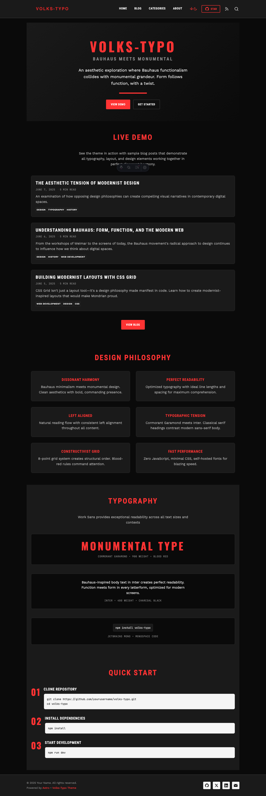
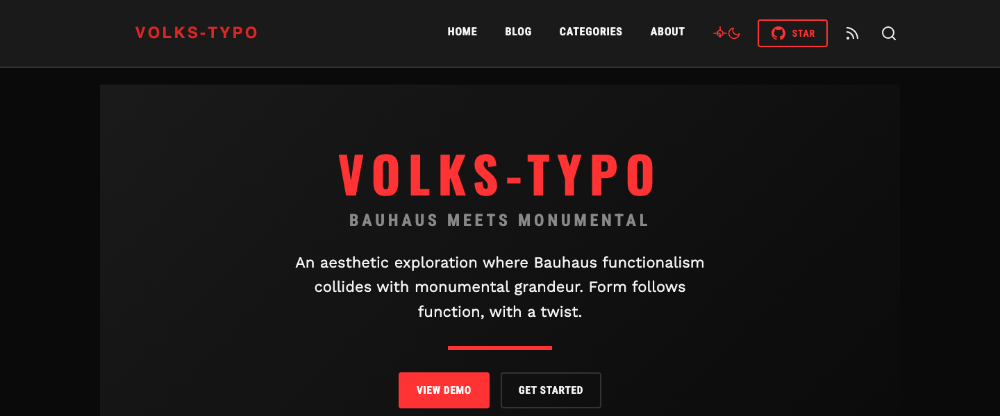
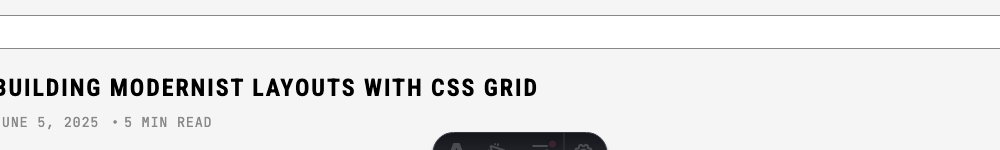
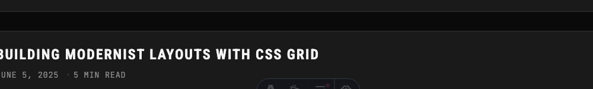
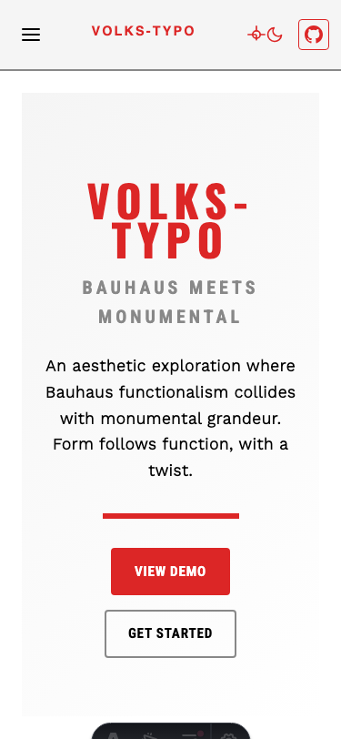
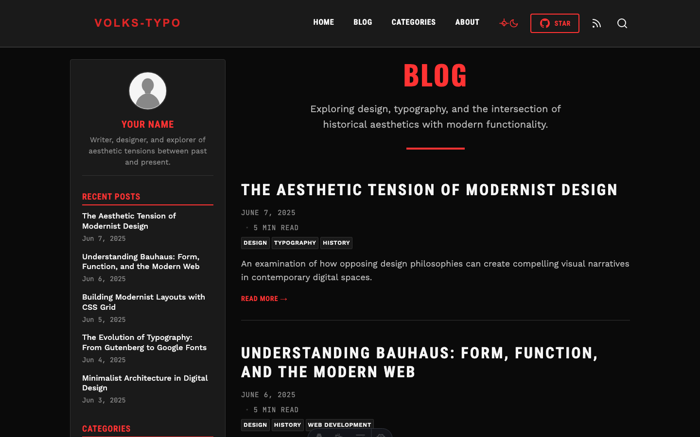

# Volks-Typo

[](https://astro.build)
[](https://opensource.org/licenses/MIT)
[](https://github.com/jdrhyne/volks-typo/releases)
[](CHANGELOG.md)

## 🚀 One-Click Deploy

Deploy your own copy of Volks-Typo with these services:

[](https://app.netlify.com/start/deploy?repository=https://github.com/jdrhyne/volks-typo)
[](https://vercel.com/new/clone?repository-url=https%3A%2F%2Fgithub.com%2Fjdrhyne%2Fvolks-typo&project-name=volks-typo-blog&repository-name=volks-typo-blog)
[](https://render.com/deploy?repo=https://github.com/jdrhyne/volks-typo)


A striking Astro blog theme that explores the aesthetic tension between Bauhaus modernism and WW2-era monumental design. Volks-Typo creates a "dissonant harmony" that is visually compelling, highly functional, and conceptually rich.

<div align="center">
  
  
</div>

*Seamless dark mode support with carefully crafted contrast and visibility*

## 🎨 Theme by

**[@jdrhyne](https://github.com/jdrhyne)** • Personal blog: [jdrhyne.me](https://jdrhyne.me) (Still under construction 🚧)

## 🌟 Features

✓ **Unique Design Philosophy** - Bauhaus functionalism meets monumental aesthetics  
✓ **Dark Mode Toggle** - Seamless theme switching with localStorage persistence and FOUC prevention  
✓ **MDX Support** - Full support for both Markdown and MDX content files  
✓ **Reading Time Display** - Automatic calculation and display of estimated reading time  
✓ **Table of Contents** - Auto-generated TOC with scroll spy navigation  
✓ **Ultra-Minimalist** - Clean, focused design with purposeful use of space  
✓ **Responsive Layout** - Mobile-first with elegant desktop sidebar  
✓ **Minimal JavaScript** - Essential JS only for enhanced features, ensuring fast performance  
✓ **Full Blog Support** - Categories, tags, archives, and recent posts  
✓ **SEO Optimized** - Built-in meta tags and structured data  
✓ **Accessibility First** - Semantic HTML and ARIA attributes  
✓ **Self-Hosted Fonts** - No external dependencies for privacy  
✓ **Type-Safe** - Full TypeScript support  
✓ **Comprehensive Testing** - Playwright test suite with visual regression testing  
✓ **Easy Configuration** - Single config file for all settings  

## 🌓 Dark Mode Showcase

<div align="center">
  
</div>

*Professional dark mode with optimized contrast for all UI elements*

<div align="center">
  
  
</div>

*Category tags with perfect visibility in both light and dark themes*  

## 🚀 Demo & Releases

- **Live Demo:** [https://jdrhyne.github.io/volks-typo/](https://jdrhyne.github.io/volks-typo/)
- **Latest Release:** [v1.1.2](https://github.com/jdrhyne/volks-typo/releases/latest)
- **All Releases:** [View on GitHub](https://github.com/jdrhyne/volks-typo/releases)
- **Changelog:** [CHANGELOG.md](CHANGELOG.md)

## 💻 Tech Stack

- **Framework:** [Astro](https://astro.build) with MDX integration
- **Type Checking:** TypeScript
- **Styling:** Scoped CSS with CSS Variables and Dark Mode support
- **Fonts:** Self-hosted via @fontsource
- **Icons:** Minimal SVG icons
- **Testing:** Playwright for browser automation and visual regression testing

## 🛠️ Quick Start

### Prerequisites

- Node.js 18.14.1 or higher
- Git

### Create a new project

```bash
# npm
npm create astro@latest -- --template jdrhyne/volks-typo

# pnpm
pnpm create astro@latest --template jdrhyne/volks-typo

# yarn
yarn create astro --template jdrhyne/volks-typo
```

### Manual Installation

1. Clone this repository:
```bash
git clone https://github.com/jdrhyne/volks-typo.git my-blog
cd my-blog
```

2. Install dependencies:
```bash
npm install
# or
pnpm install
# or
yarn install
```

3. Start the development server:
```bash
npm run dev
# or
pnpm run dev
# or
yarn dev
```

4. Open your browser at `http://localhost:4321`

## 📁 Project Structure

```
volks-typo/
├── public/
│   ├── favicon.svg          # Site favicon
│   ├── site-title.svg       # Fraktur-style site title
│   └── scripts/
│       └── theme-init.js    # Dark mode initialization script
├── src/
│   ├── components/
│   │   ├── Footer.astro     # Site footer with social links
│   │   ├── Header.astro     # Site header with navigation
│   │   ├── Layout.astro     # Main layout wrapper
│   │   ├── Sidebar.astro    # Desktop sidebar component
│   │   ├── ThemeToggle.astro # Dark mode toggle button
│   │   └── TableOfContents.astro # Auto-generated TOC component
│   ├── content/
│   │   └── blog/            # Blog content directory
│   │       ├── *.md         # Markdown blog posts
│   │       └── *.mdx        # MDX blog posts with JSX
│   ├── pages/
│   │   ├── index.astro      # Homepage
│   │   ├── about.astro      # About page
│   │   ├── blog.astro       # Blog listing page
│   │   ├── blog/
│   │   │   └── [...slug].astro  # Dynamic blog post pages
│   │   ├── categories.astro # Categories listing
│   │   └── contact.astro    # Contact page
│   ├── styles/
│   │   └── global.css       # Global styles with dark mode support
│   ├── utils/
│   │   ├── reading-time.ts  # Reading time calculation utilities
│   │   └── table-of-contents.ts # TOC generation utilities
│   └── config.ts            # Site configuration
├── tests/
│   ├── features.spec.js     # Playwright feature tests
│   └── features.spec.js-snapshots/ # Visual regression baselines
├── astro.config.mjs         # Astro configuration with MDX
├── playwright.config.js     # Playwright test configuration
├── package.json
└── tsconfig.json           # TypeScript configuration
```

## ⚙️ Configuration

All site configuration is centralized in `src/config.ts`:

```typescript
export const config = {
  title: "Volks-Typo",
  description: "A blog exploring the intersection of design, typography, and history",
  author: {
    name: "Your Name",
    bio: "Writer, designer, and explorer of aesthetic tensions.",
    avatar: "/avatar.jpg"
  },
  social: {
    github: "https://github.com/yourusername",
    twitter: "https://twitter.com/yourusername",
    instagram: "https://instagram.com/yourusername",
    linkedin: "https://linkedin.com/in/yourusername",
    email: "your.email@example.com"
  },
  siteUrl: "https://yourdomain.com"
};
```

## 🎨 Design System

### Typography

Volks-Typo uses a modern, clean typography system focused on readability and strong hierarchy:

- **Primary Headings:** Oswald - Bold, condensed sans-serif for maximum impact
- **Secondary Headings:** Roboto Condensed - Clean, professional condensed font
- **Body Text:** Work Sans - Highly readable sans-serif optimized for web
- **Code/Monospace:** JetBrains Mono - Developer-friendly monospace font
- **Site Title:** Custom SVG with distinctive styling

### Color Palette

The theme uses a clean, professional monotone palette with strategic red accents:

**Monotone Base**
- White (`#ffffff`) - Primary background
- Light Gray (`#f5f5f5`) - Surface backgrounds, cards
- Medium Gray (`#888888`) - Muted text, borders
- Dark Gray (`#333333`) - Secondary text
- Black (`#000000`) - Primary text, maximum contrast

**Accent Color**
- Red (`#dc2626`) - Primary accent for headings, links, and interactive elements

### Layout System

- **Mobile/Tablet:** Single column, full-width content
- **Desktop (1024px+):** Two-column layout with left sidebar
- **Grid:** 8-point grid system for consistent spacing
- **Max Width:** 1200px container for optimal reading

### Mobile Experience

<div align="center">
  
</div>

*Fully responsive design with mobile-optimized dark mode*

## ✨ New Features Usage

### Dark Mode
The dark mode toggle appears automatically in the header. Users can switch themes, and their preference is saved in localStorage. The theme initializes without FOUC (Flash of Unstyled Content).

**Features:**
- 🌙 One-click theme switching with smooth transitions
- 💾 Persistent theme preference across sessions
- 🎨 Carefully optimized contrast for all UI elements
- 📱 Works seamlessly on all devices
- ⚡ No flash of unstyled content on page load
- ♿ Maintains accessibility standards in both themes

<div align="center">
  
</div>

*Blog listing with optimized dark mode styling*

### MDX Support  
Create blog posts using either `.md` or `.mdx` files in `src/content/blog/`. MDX files support all Markdown syntax plus JSX components:

```mdx
---
title: "My MDX Post"
date: "2025-07-12"
---

# Regular Markdown

<div style={{color: 'red'}}>
  This is JSX in MDX!
</div>
```

### Reading Time
Reading time is automatically calculated and displayed on blog posts and listings. Based on ~200 words per minute for technical content.

### Table of Contents
TOC is auto-generated for blog posts with headings (H2-H4). It includes scroll spy functionality to highlight the current section.

### Testing
Run the comprehensive Playwright test suite with `npm run test:features`. Tests cover dark mode functionality, MDX rendering, reading time display, TOC navigation, and visual regression testing.

## 📝 Writing Content

### Blog Posts

Create blog posts as Markdown or MDX files in `src/content/blog/`:

```markdown
---
title: "The Intersection of Function and Form"
date: "2024-01-15"
author: "Your Name"
excerpt: "Exploring how Bauhaus principles shaped modern design thinking"
categories: ["Design", "History"]
tags: ["bauhaus", "modernism", "typography"]
image: "/images/bauhaus-poster.jpg"
draft: false
---

Your content here...
```

### Frontmatter Reference

| Field | Type | Required | Description |
|-------|------|----------|-------------|
| `title` | string | Yes | Post title |
| `date` | string | Yes | Publication date (YYYY-MM-DD) |
| `author` | string | No | Author name (defaults to config) |
| `excerpt` | string | No | Brief description for listings |
| `categories` | array | No | Post categories |
| `tags` | array | No | Post tags |
| `image` | string | No | Featured image path |
| `draft` | boolean | No | Hide from listings if true |

## 🛠️ Commands

All commands are run from the root of the project:

| Command | Action |
|---------|--------|
| `npm install` | Install dependencies |
| `npm run dev` | Start local dev server at `localhost:4321` |
| `npm run build` | Build production site to `./dist/` |
| `npm run preview` | Preview your build locally |
| `npm run astro ...` | Run CLI commands like `astro add` |
| `npm run check` | Check TypeScript types |
| `npm run lint` | Run ESLint |
| `npm run test:features` | Run Playwright feature tests |

## 🚀 Deployment

Volks-Typo can be deployed to any static hosting service. The theme now supports environment-based configuration for different deployment scenarios.

### Configuration

The theme uses environment variables to configure the deployment:

1. Copy `.env.example` to `.env`
2. Set the appropriate values based on your deployment target

### Netlify / Vercel (Root Domain)
```bash
# No configuration needed - works out of the box!
npm run build
```

Or set environment variables in your deployment platform:
```bash
SITE=https://your-site.netlify.app
# Leave BASE_PATH empty for root domain deployments
```

### GitHub Pages (Subdirectory)
```bash
# Set in .env or as environment variables
SITE=https://yourusername.github.io
BASE_PATH=/your-repo-name/

npm run build
```

### Local Development with Base Path
```bash
# Set in .env
SITE=http://localhost:4321
BASE_PATH=/volks-typo/

npm run dev
```

### Build Commands
```bash
# Standard build
npm run build

# Build with custom environment
SITE=https://example.com BASE_PATH=/blog/ npm run build
```

## 📊 Performance

Volks-Typo is optimized for speed and efficiency:

- **Zero JavaScript** - Pure HTML and CSS
- **Minimal CSS** - ~20KB gzipped total
- **Self-hosted fonts** - No external requests
- **Optimized images** - Using Astro's Image component
- **Static generation** - Fast page loads

## 🎯 Customization Guide

### Colors

Edit CSS variables in `src/styles/global.css`:

```css
:root {
  /* Monotone Palette */
  --color-white: #ffffff;
  --color-light-gray: #f5f5f5;
  --color-medium-gray: #888888;
  --color-dark-gray: #333333;
  --color-black: #000000;
  
  /* Accent Color */
  --color-accent-red: #dc2626;
}
```

### Typography

Modify font families in `src/styles/global.css`:

```css
:root {
  --font-heading-primary: 'Oswald', sans-serif;
  --font-heading-secondary: 'Roboto Condensed', sans-serif;
  --font-body: 'Work Sans', sans-serif;
  --font-mono: 'JetBrains Mono', monospace;
}
```

### Layout

The theme uses CSS Grid for layouts. Key files:
- `src/components/Layout.astro` - Main grid container
- `src/components/Sidebar.astro` - Desktop sidebar
- `src/styles/global.css` - Responsive breakpoints

## 🤝 Contributing

Contributions are welcome! Please feel free to submit a Pull Request. For major changes, please open an issue first to discuss what you would like to change.

1. Fork the repository
2. Create your feature branch (`git checkout -b feature/amazing-feature`)
3. Commit your changes (`git commit -m 'Add some amazing feature'`)
4. Push to the branch (`git push origin feature/amazing-feature`)
5. Open a Pull Request

## 📄 License

This project is licensed under the MIT License - see the [LICENSE](LICENSE) file for details.

## 🙏 Acknowledgments

- Design philosophy inspired by the Bauhaus movement, WW2-era monumental aesthetics, and street & subway signage from Vienna 🇦🇹
- Built with [Astro](https://astro.build)
- Typography powered by [Fontsource](https://fontsource.org/)

## 📋 Project Information

- **Changelog:** [CHANGELOG.md](CHANGELOG.md) - Detailed version history and release notes
- **Releases:** [GitHub Releases](https://github.com/jdrhyne/volks-typo/releases) - Download specific versions
- **Issues:** [GitHub Issues](https://github.com/jdrhyne/volks-typo/issues) - Bug reports and feature requests
- **Discussions:** [GitHub Discussions](https://github.com/jdrhyne/volks-typo/discussions) - Community support

## 💬 Support

- **Author:** [@jdrhyne](https://github.com/jdrhyne) • Personal blog: [jdrhyne.me](https://jdrhyne.me) (under construction 🚧) 
---

**[Volks-Typo](https://github.com/jdrhyne/volks-typo)** by [@jdrhyne](https://github.com/jdrhyne) • MIT License
